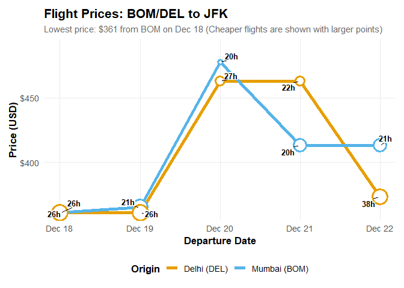
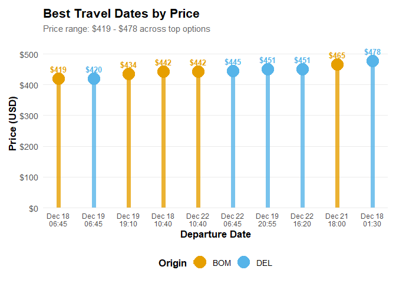

# Flight Analysis: Find the best flights

An R package for analyzing, forecasting, and collecting flight data and
prices from Google Flights.

## Features

- Detailed scraping and querying tools for Google Flights using chromote
- Support for multiple trip types: one-way, round-trip, chain-trip, and
  perfect-chain
- Flexible date search across multiple airports and date ranges
- Summary tables showing prices by city and date
- Automatic identification of cheapest travel dates
- Visualization functions for price trends and best dates

## Installation

You can install the development version of flightanalysis from GitHub:

``` r
install.packages('flightanalysis', 
  repos = c('https://rempsyc.r-universe.dev', 'https://cloud.r-project.org'))

# Or if you need the version from the last hour, install through `remotes`
# install.packages("remotes")
remotes::install_github("rempsyc/flightanalysis")
```

## Usage

### Loading the Package

``` r
library(flightanalysis)
```

### Creating Flight Queries and Fetching the Data

The main scraping function that makes up the backbone of most
functionalities is `fa_define_query()`. It serves as a data object,
preserving the flight information as well as meta-data from your query.
`fa_fetch_flights()` then fetches flight information from that query.
Origin and destination airports can be specified as a mix of Airport
3-letter codes, city 3-letter codes, or city names.

``` r
# Round-trip
query <- fa_define_query("NYC", "London", "2025-12-20", "2026-01-05")

# Same as:
query <- fa_define_query("New York", "LON", "2025-12-20", "2026-01-05")
query
#> Flight Query( {Not Yet Fetched}
#> 2025-12-20: NYC --> LON
#> 2026-01-05: LON --> NYC
#> )

# Fetch the flight data
flights <- fa_fetch_flights(query)
#>   Segment 1/2: NYC -> LON on 2025-12-20
#>   [OK] Successfully parsed 7 flights
#>   Segment 2/2: LON -> NYC on 2026-01-05
#>   [OK] Successfully parsed 16 flights
#>   [OK] Total flights retrieved: 23

# View the flight data
head(flights$data[1:11]) |>
  knitr::kable()
```

| departure_date | departure_time | arrival_date | arrival_time | origin | origin_city | destination | destination_city | airlines | travel_time | price |
|:---|:---|:---|:---|:---|:---|:---|:---|:---|:---|---:|
| 2025-12-20 | 22:40 | 2025-12-21 | 11:05 | EWR | Newark | LHR | London | United, Lufthansa, Austrian, Brussels Airlines | 7 hr 25 min | 844 |
| 2025-12-20 | 18:05 | 2025-12-21 | 06:00 | JFK | New York | LGW | London | Price graph | 6 hr 55 min | 859 |
| 2025-12-20 | 19:45 | 2025-12-22 | 07:10 | LGA | New York | LHR | London | Air Canada, United | 30 hr 25 min | 354 |
| 2025-12-20 | 19:20 | 2025-12-22 | 09:00 | JFK | New York | LGW | London | American, British Airways | 32 hr 40 min | 480 |
| 2025-12-20 | 06:55 | 2025-12-21 | 07:10 | EWR | Newark | LHR | London | Air Canada, United | 19 hr 15 min | 728 |
| 2025-12-20 | 15:04 | 2025-12-21 | 12:40 | LGA | New York | LCY | London | American, Aer Lingus, British Airways, Iberia, BA Cityflyer | 16 hr 36 min | 854 |

The package supports multiple trip types:

- **One-way**: `fa_define_query("JFK", "IST", "2025-07-20")`
- **Round-trip**:
  `fa_define_query("JFK", "IST", "2025-07-20", "2025-08-20")`
- **Chain-trip**:
  `fa_define_query("JFK", "IST", "2025-08-20", "RDU", "LGA", "2025-12-25")`
- **Perfect-chain**:
  `fa_define_query("JFK", "2025-09-20", "IST", "2025-09-25", "JFK")`

## Flexible Date Search

The package supports flexible date search across multiple airports and
dates:

``` r
# Create query objects for multiple origins and dates
queries <- fa_define_query_range(
  origin = c("BOM", "DEL"),
  dest = "JFK",
  date_min = "2025-12-18",
  date_max = "2025-12-22"
)

# Fetch all flights
flights <- fa_fetch_flights(queries, verbose = FALSE)

# Create summary table (City × Date with prices)
fa_summarize_prices(flights) |>
  knitr::kable()
```

| City | Origin | 2025-12-18 | 2025-12-19 | 2025-12-20 | 2025-12-21 | 2025-12-22 | Average_Price |
|:---|:---|:---|:---|:---|:---|:---|:---|
| Mumbai | BOM | \$419 | \$503 | \$539 | \$465 | \$442 | \$474 |
| Delhi | DEL | \$420 | \$420 | \$470 | \$510 | \$445 | \$453 |
| Best | Day | X |  |  |  |  |  |

``` r

# Find the cheapest dates
fa_find_best_dates(
  flights, 
  n = 5,
  by = "min",
  price_max = 1400,
  max_stops = 1,
  travel_time_max = 26  # 26 hours (numeric = hours, or use "26 hr" format)
  ) |>
  knitr::kable()
```

| departure_date | departure_time | arrival_date | arrival_time | origin | price | num_stops | layover | travel_time | co2_emission_kg | airlines | n_routes |
|:---|:---|:---|:---|:---|---:|---:|:---|:---|---:|:---|---:|
| 2025-12-18 | 10:40 | 2025-12-18 | 19:30 | BOM | 442 | 1 | 1 hr LHR | 19 hr 20 min | 792 | Virgin Atlantic, Delta | 1 |
| 2025-12-19 | 19:10 | 2025-12-19 | 06:00 | BOM | 434 | 1 | 2 hr 40 min DEL | 21 hr 20 min | 991 | IndiGo, American | 1 |
| 2025-12-19 | 20:55 | 2025-12-19 | 09:00 | DEL | 451 | 1 | 3 hr 30 min AUH | 22 hr 35 min | 843 | Etihad | 1 |
| 2025-12-22 | 10:40 | 2025-12-22 | 22:55 | BOM | 442 | 1 | 4 hr 25 min LHR | 22 hr 45 min | 796 | Virgin Atlantic, Delta | 1 |
| 2025-12-23 | 20:55 | 2025-12-23 | 09:00 | DEL | 451 | 1 | 3 hr 30 min AUH | 22 hr 35 min | 802 | Etihad | 1 |

## Visualizing Price Data

The package includes plotting functions to visualize price trends and
best dates:

``` r
# Plot price trends across dates
fa_plot_prices(flights, 
               title = "Flight Prices: BOM/DEL to JFK",
               size_by = "travel_time",
               annotate_col = "travel_time")
```



``` r

# Plot best travel dates
fa_plot_best_dates(flights)
```



## Original Python Package

**Credits:** This package is an R implementation inspired by the
original Python package
[google-flight-analysis](https://github.com/celebi-pkg/flight-analysis)
by Kaya Celebi.
